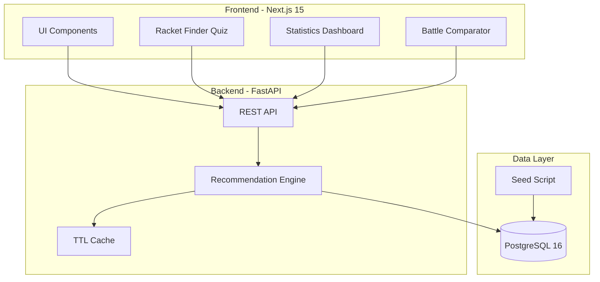

# Arquitetura do SliceInsights

> **Última Atualização**: Janeiro 2026 | **Stack**: FastAPI + Next.js 15 + PostgreSQL 16 | **Versão**: 1.6

---

## 🏗️ Visão Geral

SliceInsights é uma plataforma de recomendação de raquetes de Pickleball com arquitetura **cliente-servidor moderna**, otimizada para performance e experiência premium.



---

## 📦 Tech Stack Detalhado

### Frontend
| Tecnologia | Versão | Uso |
|------------|--------|-----|
| **Next.js** | 15 (App Router) | Framework React com SSR/SSG |
| **TypeScript** | 5.x | Type safety |
| **Tailwind CSS** | 3.x | Styling system |
| **Framer Motion** | 11.x | Animações premium |
| **shadcn/ui** | Latest | Component library |
| **Recharts** | 2.x | Visualizações de dados |

### Backend
| Tecnologia | Versão | Uso |
|------------|--------|-----|
| **FastAPI** | 0.115+ | Framework API |
| **Python** | 3.11+ | Linguagem |
| **SQLModel** | 0.0.22 | ORM (SQLAlchemy + Pydantic) |
| **AsyncPG** | 0.30+ | Driver PostgreSQL assíncrono |
| **Pydantic** | 2.x | Validação de dados |
| **SlowAPI** | 0.1.9+ | Rate limiting |
| **Structlog** | 24.x | Logging estruturado |

### Infraestrutura
| Tecnologia | Versão | Uso |
|------------|--------|-----|
| **PostgreSQL** | 16-alpine | Database |
| **Docker** | Latest | Containerização |
| **Docker Compose** | v2 | Orquestração local |
| **Railway** | Cloud | Deploy produção |

---

## 🔄 Fluxo da Aplicação

### 1. Fluxo do Usuário (UX)

```mermaid
sequenceDiagram
    participant U as Usuário
    participant F as Frontend (Next.js)
    participant A as API (FastAPI)
    participant E as Recommendation Engine
    participant DB as PostgreSQL

    U->>F: Acessa página inicial
    F->>U: Exibe catálogo + Quiz CTA
    
    rect rgb(20, 20, 40)
        note right of U: Import Calculator Flow
        U->>F: Visualiza raquete internacional
        F->>F: Detecta available_in_brazil=False
        F->>U: Exibe badge "IMPORTADO" + Botão Calculadora
        U->>F: Abre Calculadora de Importação
        F->>U: Exibe estimativa (Imposto 60% + ICMS)
    end

    U->>F: Inicia Quiz (6 perguntas)
    F->>F: Valida respostas localmente
    
    U->>F: Submete Quiz
    F->>A: POST /api/v1/recommendations
    A->>E: Processa com algoritmo smart scoring
    E->>DB: Query com filtros + agregações
    DB-->>E: Resultado (top paddles)
    E->>E: Aplica value score + ranking
    E-->>A: Lista rankeada
    A-->>F: JSON response
    F->>F: Renderiza com animação
    F->>U: Exibe recomendações
    
    U->>F: Clica em paddle
    F->>U: Abre Paddle Detail Drawer
```



### 2. Fluxo Técnico (Sistema)

#### Monetização (Affiliate Service)
O `AffiliateService` intercepta URLs de ofertas e aplica tags de parceiros automaticamente:
1. **Amazon**: Adiciona `tag=sliceinsights-20`
2. **Mercado Livre**: Formata link de afiliado ML
3. **Shopee**: (Roadmap) Integração futura

#### Recomendação de Paddles (Engine)

O motor de recomendação (`RecommendationEngine`) é o coração do SliceInsights, transformando specs técnicas em decisões de compra.

1. **Input**: Usuário responde quiz (10 perguntas, incluindo slider Power/Control).
2. **Persistência (Client-Side)**: Respostas são salvas em `sessionStorage` e `localStorage` para Hyper-Personalização.
3. **Filtros Hard** (SQL Level):
   - Orçamento e Preferência de Peso.
   - Tennis Elbow (Exclui raquetes com núcleo < 16mm).
3. **Smart Scoring**:
   - **Unified Ratings**: Todas as raquetes são processadas pela função `calculate_paddle_ratings`, garantindo que notas de 0-10 sejam consistentes entre a busca e a exibição.
   - **Pesos Dinâmicos**: O algoritmo aplica pesos baseados no `PlayStyle` (Power vs Control).
   - **Value Score**: Cálculo de custo-benefício (Performance / Preço).
4. **Ranking & Insights**:
   - Geração de `match_reasons` dinâmicos.
   - Aplicação de tags baseadas em outliers de performance (ex: "Spin Machine").

> 📖 Veja a [Documentação Detalhada do Algoritmo](technical/recommendation_system.md) para fórmulas matemáticas e lógica de normalização.

---

## 🗄️ Arquitetura de Dados

### Schema Principal

#### Tabela: `brands`
```sql
id          SERIAL PRIMARY KEY
name        VARCHAR(100) UNIQUE
website     VARCHAR(255)
```

#### Tabela: `paddle_master` (Single Source of Truth)
```sql
id                   UUID PRIMARY KEY
brand_id             INTEGER REFERENCES brands(id)
model_name           VARCHAR(200)
search_keywords      TEXT[]

-- Specs Físicas
core_thickness_mm    FLOAT
core_material        VARCHAR(100)
face_material        ENUM(carbon, fiberglass, hybrid, kevlar)
shape                ENUM(standard, elongated, widebody)

-- Métricas Avançadas
swing_weight         INTEGER
twist_weight         FLOAT
spin_rpm             INTEGER
power_original       FLOAT
handle_length        VARCHAR(10)
grip_circumference   VARCHAR(10)

-- Performance (0-10)
power_rating         INTEGER

-- Targeting
ideal_for_tennis_elbow  BOOLEAN
skill_level             ENUM(beginner, intermediate, advanced)

-- Metadata
available_in_brazil  BOOLEAN DEFAULT TRUE  -- Import Calculator Trigger
specs_source         VARCHAR(50)   -- 'csv_dump_verified', 'manual', etc
specs_confidence     FLOAT         -- 0.0 - 1.0
is_featured          BOOLEAN
image_url            VARCHAR(255)
created_at           TIMESTAMP
updated_at           TIMESTAMP
```

#### Tabela: `market_offers` (Dados Voláteis)
```sql
id           SERIAL PRIMARY KEY
paddle_id    UUID REFERENCES paddle_master(id)
store_name   VARCHAR(100)
price_brl    DECIMAL(10,2)
url          VARCHAR(512)
affiliate_url VARCHAR(512) -- Generated by AffiliateService
is_active    BOOLEAN
last_updated TIMESTAMP
```

### Queries Críticas Otimizadas

**1. List Paddles (Evita N+1)**
```python
# Subquery para agregações de preço
offer_subq = (
    select(
        MarketOffer.paddle_id,
        func.min(MarketOffer.price_brl).label("min_price"),
        func.count(MarketOffer.id).label("offer_count")
    )
    .where(MarketOffer.is_active == True)
    .group_by(MarketOffer.paddle_id)
    .subquery()
)

# Query principal com JOIN
query = (
    select(PaddleMaster, offer_subq.c.min_price, offer_subq.c.offer_count)
    .options(selectinload(PaddleMaster.brand))
    .outerjoin(offer_subq, PaddleMaster.id == offer_subq.c.paddle_id)
)
```

---

## 🎨 Design System

### Cores Principais
```css
--lime-green: #CEFF00     /* Action color, CTAs */
--background: 222.2 84% 4.9%  /* Dark mode base */
--foreground: 210 40% 98%     /* Text color */
```

### Componentes Frontend

#### Core Components
- `PaddleCard`: Card de produto com badges técnicos
- `PaddleDetailDrawer`: Sheet modal com specs completas
- `PaddleComparator`: Comparação lado-a-lado ("Battle Mode")
- `RacketFinderQuiz`: Quiz de 10 perguntas com labor illusion e slider Power/Control
- `StatisticsClient`: Hub de inteligência de mercado com Hyper-Personalização (Ideal Point, Delta Score)

#### UI Primitives (shadcn/ui)
- Button, Input, Card, Sheet, Tabs, Select, Tooltip
- Custom: `InfoTooltip`, `MarketSegments`, `HiddenGems`

### Animações (Framer Motion)

```typescript
// Labor Illusion no Quiz
await new Promise(resolve => setTimeout(resolve, 1200));

// Stagger nos resultados
<motion.div
  variants={staggerContainer}
  initial="hidden"
  animate="show"
>
  {paddles.map(paddle => (
    <motion.div variants={fadeInUp} key={paddle.id}>
      <PaddleCard />
    </motion.div>
  ))}
</motion.div>
```

---

## 🔒 Production Features

### Segurança
- ✅ **CORS whitelist** configurável via env
- ✅ **Rate limiting** (30-100 req/min por endpoint)
- ✅ **Input validation** com Pydantic

### Observabilidade
- ✅ **Structured logging** (Structlog JSON)
- ✅ **Prometheus metrics** em `/metrics`
- ✅ **Sentry integration** (opcional via env)
- ✅ **Health check** em `/api/v1/health`

### Performance
- ✅ **Query optimization** (subqueries, joins)
- ✅ **TTL cache** para recomendações
- ✅ **Docker multi-stage build** (frontend)
- ✅ **Async drivers** (AsyncPG)

---

## 📊 Métricas Atuais

| Métrica | Valor |
|---------|-------|
| Raquetes no DB | 460 |
| Marcas | ~50 |
| Endpoints API | 6 |
| Cobertura de Testes | 60%+ (15 testes) |
| Tempo de resposta | \u003c100ms (P95) |

---

## 🚀 Deploy

### Desenvolvimento
```bash
docker compose up -d --build
# Frontend: http://localhost:3000
# API: http://localhost:8002
```

### Produção (Railway)
1. Conectar repositório GitHub
2. Adicionar PostgreSQL addon
3. Configurar variáveis de ambiente
4. Deploy automático!

📖 Veja [`operations/railway_deploy.md`](operations/railway_deploy.md) para detalhes.

---

## 📝 Próximos Passos Técnicos

- [ ] Implementar cache Redis (opcional)
- [ ] Adicionar testes E2E com Playwright
- [ ] Setup CI/CD no GitHub Actions
- [ ] Migrar frontend para SSG em páginas estáticas

---

**Referências**:
- [Database Schema](technical/database_schema.md)
- [API Specification](technical/api_specification.md)
- [Runbook](operations/runbook.md)
