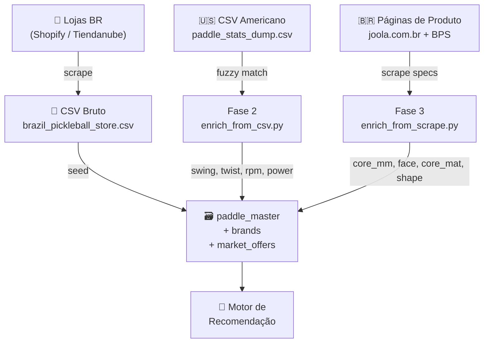

# Catálogo de Raquetes — Pipeline de Construção & Enriquecimento

> Como os dados de raquetes entram no sistema, são limpos e enriquecidos com specs técnicos.

---

## Visão Geral do Pipeline



---

## Fase 1: Catálogo Base (Scraping de Lojas BR)

### Script: `scripts/scrape_brazil_store.py`

| Campo | Fonte | Método |
|---|---|---|
| `brand_name` | Título do produto | `parse_product_title()` |
| `model_name` | Título do produto | Remoção de prefixos ("Raquete", "Kit") |
| `price_brl` | Elemento `.js-price-display` | Regex `R$ X.XXX,XX` |
| `image_url` | `data-srcset` da imagem | Maior resolução disponível |
| `product_url` | Link do card | URL completa |

### Script: `scripts/scrape_joola.py`

Mesmo processo para a loja oficial Joola Brasil (Shopify).

### Seed: `app/db/seed_brazil_catalog.py`

Lê os CSVs de scrape e popula as tabelas:

- **`brands`** — Nome normalizado da marca
- **`paddle_master`** — Modelo, marca (FK), imagem, disponibilidade BR
- **`market_offers`** — Preço BRL, URL da loja, status ativo

> ⚡ Nesta fase, todos os campos técnicos (`core_thickness_mm`, `face_material`, etc.) estão **NULL** e `specs_confidence = 0`.

---

## Fase 2: Enriquecimento via CSV Americano

### Script: `scripts/enrich_from_csv.py`

Cruza cada raquete do banco com o dataset americano `paddle_stats_dump.csv` (fonte: análises de equipamento US) usando fuzzy match.

### Processo

1. **Normalização Unicode** — Remove acentos PT-BR para comparação cross-language
2. **Remoção de ruído** — Elimina tokens como "raquete", "de", "pickleball"
3. **Resolução de alias** — `"3rd shot" → "3rdshot"`, `"slk" → "selkirk"`
4. **Match exato** — Busca `(brand, model)` normalizado no CSV
5. **Match fuzzy** — `SequenceMatcher` com bônus para substring match, threshold `≥ 0.60`
6. **Validação de materiais** — `clean_material()` rejeita URLs, números e textos promocionais

### Campos populados

| Campo | Tipo | Exemplo |
|---|---|---|
| `swing_weight` | int | 114 |
| `twist_weight` | float | 6.2 |
| `spin_rpm` | int | 1850 |
| `power_rating` | float | 0.78 |
| `core_thickness_mm` | float | 16.0 |
| `handle_length` | str | "5.5" |
| `grip_circumference` | str | "4.25" |
| `core_material` | str | "Polymer Honeycomb" |
| `face_material` | str | "CARBON" |
| `shape` | str | "ELONGATED" |

> 📊 **Cobertura:** ~22 paddles (marcas Joola, Engage, Selkirk com presença US)

---

## Fase 3: Enriquecimento via Scrape das Lojas BR

### Script: `scripts/enrich_from_scrape.py`

Para os ~50 paddles que o CSV americano não cobriu, entramos nas **páginas de produto** e extraímos specs diretamente.

### Fontes e Métodos

| Loja | Seletor | Formato |
|---|---|---|
| **joola.com.br** | `.metafield-row` → `.metafield-label` + `.metafield-value` | Tabela estruturada (aba "Especificação") |
| **BR Pickleball Store** | `.user-content` | Texto livre com regex |

### Mapeamentos PT-BR → EN

```
"fibra de carbono" → CARBON
"fibra de vidro"   → FIBERGLASS
"polímero colmeia" → Polymer Honeycomb
"elongada"         → ELONGATED
```

### Dados salvos em: `app/data/scraped_product_specs.json`

Arquivo JSON com 44 entradas, cada uma contendo:
```json
{
  "brand": "Joola",
  "model_pattern": "Perseus Double Vision 16mm",
  "core_thickness_mm": 16.0,
  "face_material": "CARBON",
  "core_material": "Polymer Honeycomb",
  "shape": "ELONGATED",
  "source": "joola.com.br"
}
```

> 📊 **Cobertura:** +42 paddles enriquecidos com dados estruturais

---

## Estatísticas de Preenchimento (Snapshot atual)

> Última atualização: 2026-02-26. Total: **72 paddles** no catálogo.

### Taxa de Preenchimento por Campo

| Campo | Preenchidos | % | Fonte Principal |
|---|:---:|:---:|---|
| `model_name` | 72 | 100% | Scrape de loja BR (Fase 1) |
| `image_url` | 72 | 100% | Scrape de loja BR (Fase 1) |
| `price_brl` | 72 | 100% | Scrape de loja BR (Fase 1) |
| `core_thickness_mm` | 62 | **86%** | CSV US (20) + Scrape BR (42) |
| `face_material` | 47 | **65%** | CSV US (5) + Scrape BR (42) |
| `core_material` | 45 | **63%** | CSV US (20) + Scrape BR (25) |
| `shape` | 33 | **46%** | CSV US (13) + Scrape BR (20) |
| `swing_weight` | 20 | 28% | CSV US exclusivo |
| `twist_weight` | 22 | 31% | CSV US exclusivo |
| `spin_rpm` | 19 | 26% | CSV US exclusivo |
| `power_rating` | 20 | 28% | CSV US exclusivo |
| `handle_length` | 20 | 28% | CSV US exclusivo |
| `grip_circumference` | 20 | 28% | CSV US exclusivo |

### Cobertura por Fonte de Dados

| Fonte (`specs_source`) | Paddles | Campos Cobertos |
|---|:---:|---|
| `br_scrape_joola.com.br` | 21 | core_mm, face, core_mat, shape |
| `br_scrape_brazilpickleballstore.com.br` | 21 | core_mm, face, core_mat, shape |
| `csv_enriched` (CSV US + scrape BR) | 22 | Todos os campos performance + estruturais |
| `br_scraper` (apenas seed, sem enriquecimento) | 8 | Somente dados comerciais (preço, imagem) |

### Distribuição de Confiança

| Tier | Paddles | % | Significado |
|---|:---:|:---:|---|
| 🟢 Alta (≥ 0.75) | 20 | 28% | Specs completos via CSV americano |
| 🟡 Parcial (0.30 – 0.74) | 42 | 58% | Dados estruturais via scrape BR |
| 🟠 Baixa (> 0) | 2 | 3% | Specs mínimos |
| 🔴 Zero | 8 | 11% | Non-paddles (6) + sem match (2) |

---

## Filtros de Qualidade

### Non-Paddle Detection

O script identifica e pula itens que não são raquetes:

```python
NON_PADDLE_KEYWORDS = {'kit de pickleball', 'mala', 'mochila', 'raqueteira', 'bolsa', 'bola', 'case', 'duffle'}
```

### Material Validation (`clean_material`)

Rejeita valores que claramente não são materiais:
- Números puros (`"12345"`)
- URLs (`"bit.ly/xxx"`)
- Strings muito curtas (`"ab"`)

### Specs Confidence Score

```python
# Fórmula
confidence = (performance_fields / 4) + (structural_fields * 0.1)
# Onde:
#   performance = swing_weight, twist_weight, spin_rpm, power_rating
#   structural  = core_thickness_mm, face_material, core_material
```

| Tier | Confidence | Significado |
|---|---|---|
| 🟢 Alta | ≥ 0.75 | Specs completos (fonte US) |
| 🟡 Parcial | 0.30 – 0.74 | Dados estruturais (fonte BR) |
| 🟠 Baixa | > 0 | Specs mínimos |
| 🔴 Zero | 0 | Sem dados |

---

## Como Rodar

```bash
# 1. Scrape das lojas (requer Playwright)
python scripts/scrape_brazil_store.py
python scripts/scrape_joola.py

# 2. Seed no banco
docker compose exec backend_v3 python -m app.db.seed_brazil_catalog

# 3. Enriquecimento CSV americano
docker compose exec backend_v3 python scripts/enrich_from_csv.py
docker compose exec backend_v3 python scripts/enrich_from_csv.py --dry-run  # preview

# 4. Enriquecimento via scrape BR
docker compose exec backend_v3 python scripts/enrich_from_scrape.py
docker compose exec backend_v3 python scripts/enrich_from_scrape.py --dry-run  # preview
```

---

## Arquivos Relevantes

| Arquivo | Descrição |
|---|---|
| [`scrape_brazil_store.py`](file:///home/diego/Documentos/projetos/data-products/sliceinsights/scripts/scrape_brazil_store.py) | Scraper Playwright para BPS |
| [`scrape_joola.py`](file:///home/diego/Documentos/projetos/data-products/sliceinsights/scripts/scrape_joola.py) | Scraper Playwright para Joola BR |
| [`seed_brazil_catalog.py`](file:///home/diego/Documentos/projetos/data-products/sliceinsights/app/db/seed_brazil_catalog.py) | Seed das tabelas paddle_master + brands |
| [`enrich_from_csv.py`](file:///home/diego/Documentos/projetos/data-products/sliceinsights/scripts/enrich_from_csv.py) | Enrichment via CSV americano |
| [`enrich_from_scrape.py`](file:///home/diego/Documentos/projetos/data-products/sliceinsights/scripts/enrich_from_scrape.py) | Enrichment via scrape das lojas BR |
| [`scraped_product_specs.json`](file:///home/diego/Documentos/projetos/data-products/sliceinsights/app/data/scraped_product_specs.json) | Knowledge base de specs extraídos |
| [`paddle_stats_dump.csv`](file:///home/diego/Documentos/projetos/data-products/sliceinsights/app/data/paddle_stats_dump.csv) | Dataset de specs americano |
