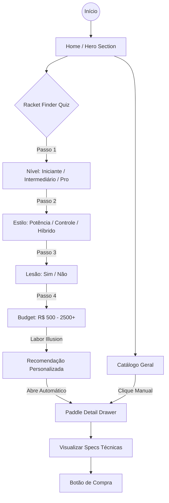
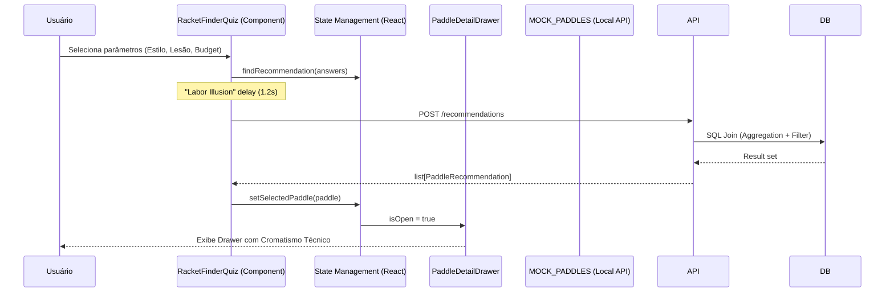

# Fluxo da Aplicação - Niterói Raquetes

Este documento detalha o fluxo de experiência do usuário (UX) e a arquitetura técnica por trás do **Racket Finder**.

## 1. Experiência do Usuário (UX Flow)

### Detalhes dos Passos:
1.  **Entrada**: O usuário aterrissa na Home e é impactado pelo CTA do "AI Advisor".
2.  **Quiz Dinâmico**: O usuário responde perguntas rápidas com feedback visual instantâneo (vibrância no hover, animações de entrada).
3.  **Engine de Match**: A aplicação processa as respostas contra os atributos técnicos (`powerLevel`, `controlLevel`) dos paddles no `MOCK_PADDLES`.
4.  **Apresentação**: O resultado é apresentado em um Drawer premium que mantém o contexto da página anterior.

## 2. Fluxo Técnico (System Flow)

### Componentes Chave:
- **`RacketFinderQuiz`**: Controla o estado local do quiz e a lógica de recomendação.
- **`PaddleCard`**: Componente de apresentação puro com badges dinâmicos.
- **`PaddleDetailDrawer`**: Gerencia a exibição profunda de dados técnicos sem navegação de página.
- **`Framer Motion`**: Orquestra todas as transições entre estados para garantir o "feel" premium.

## 3. Arquitetura de Cores e Estilo
- **Highlight**: `Lime Green (#CEFF00)` - Usado para CTAs e estados ativos para guiar o olhar.
- **Base**: `Glassmorphism` - Cartões e Drawers usam `backdrop-blur` para transmitir polimento e profundidade.
- **Tipografia**: Uso de pesos `font-black` para cabeçalhos para reforçar a estética esportiva/agressiva.
