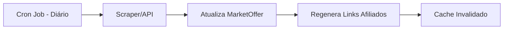

# Roadmap de Monetização - Ads & Afiliados

> **Princípio**: Máxima automação, mínima intervenção humana.

---

## 1. Afiliados Automatizados

### 1.1 Programas Prioritários

| Programa | Comissão | Link de Cadastro |
|----------|----------|------------------|
| Amazon Associates | 3-10% | [associados.amazon.com.br](https://associados.amazon.com.br) |
| Mercado Livre | 4-16% | [mercadolivre.com.br/afiliados](https://www.mercadolivre.com.br/afiliados) |
| Shopee | 5-14% | [shopee.com.br/affiliate](https://shopee.com.br/affiliate) |

### 1.2 Automação Técnica

**Objetivo**: Links de afiliado gerados e inseridos automaticamente.

```python
# Estrutura proposta para app/services/affiliate_service.py

AFFILIATE_CONFIG = {
    "amazon": {
        "tag": "niteroi-raquetes-20",  # Seu tag de afiliado
        "base_url": "https://www.amazon.com.br/dp/{asin}?tag={tag}"
    },
    "mercadolivre": {
        "tracking_id": "SEU_TRACKING_ID",
        "base_url": "https://produto.mercadolivre.com.br/{mlb_id}?tracking_id={tracking_id}"
    }
}

def generate_affiliate_link(product_url: str, source: str) -> str:
    """Injeta automaticamente parâmetros de afiliado na URL."""
    # Implementar parsing e injeção de tracking
    pass
```

**Campos a adicionar no `MarketOffer`**:
```python
class MarketOffer(SQLModel):
    # ... campos existentes ...
    affiliate_tag: str | None  # Tag específico do programa
    source_platform: str       # "amazon", "mercadolivre", "shopee"
```

### 1.3 Pipeline de Atualização de Preços



**Implementação**: 
- GitHub Actions ou cron no servidor
- Script `scripts/update_prices.py` executado 1x/dia
- Usa APIs oficiais quando disponíveis (Amazon Product Advertising API)

---

## 2. Ads Automatizados

### 2.1 Setup Google AdSense

**Posicionamentos Estratégicos (Non-Intrusive)**:

| Local | Tipo de Ad | Prioridade |
|-------|-----------|------------|
| Resultado do Quiz (após top 3) | Display Responsivo | Alta |
| Footer do Catálogo | Banner Horizontal | Média |
| Entre cards de raquete | In-Feed Native | Média |

### 2.2 Implementação Next.js

```tsx
// components/ads/AdBanner.tsx
'use client';

import { useEffect } from 'react';

interface AdBannerProps {
  slot: string;
  format?: 'auto' | 'rectangle' | 'horizontal';
}

export function AdBanner({ slot, format = 'auto' }: AdBannerProps) {
  useEffect(() => {
    try {
      (window.adsbygoogle = window.adsbygoogle || []).push({});
    } catch (e) {
      console.error('AdSense error:', e);
    }
  }, []);

  return (
    <ins
      className="adsbygoogle"
      style={{ display: 'block' }}
      data-ad-client="ca-pub-XXXXXXXXXXXXXXXX"
      data-ad-slot={slot}
      data-ad-format={format}
      data-full-width-responsive="true"
    />
  );
}
```

### 2.3 Configuração Automática

```tsx
// app/layout.tsx - Adicionar no <head>
<Script
  async
  src="https://pagead2.googlesyndication.com/pagead/js/adsbygoogle.js?client=ca-pub-XXXXXXXXXXXXXXXX"
  crossOrigin="anonymous"
  strategy="afterInteractive"
/>
```

---

## 3. Tracking & Analytics

### 3.1 Eventos a Rastrear (GA4)

| Evento | Trigger | Valor |
|--------|---------|-------|
| `quiz_completed` | Usuário finaliza quiz | - |
| `affiliate_click` | Clique em link de compra | `{paddle_id, store}` |
| `ad_impression` | Ad renderizado | `{slot_id}` |
| `conversion` | Compra confirmada | `{revenue}` |

### 3.2 Implementação GTM/GA4

```tsx
// lib/analytics.ts
export const trackAffiliateClick = (paddleId: string, store: string) => {
  if (typeof window !== 'undefined' && window.gtag) {
    window.gtag('event', 'affiliate_click', {
      paddle_id: paddleId,
      store: store,
      currency: 'BRL'
    });
  }
};
```

---

## 4. Checklist de Implementação

### Semana 1: Setup
- [ ] Criar contas em programas de afiliados (Amazon, ML, Shopee)
- [ ] Aplicar para Google AdSense
- [ ] Configurar Google Analytics 4

### Semana 2: Código
- [ ] Criar `affiliate_service.py` com lógica de geração de links
- [ ] Adicionar campos `affiliate_tag` e `source_platform` no schema
- [ ] Criar componente `AdBanner.tsx`
- [ ] Integrar tracking de cliques

### Semana 3: Automação
- [ ] Configurar GitHub Action para atualização diária de preços
- [ ] Implementar script `update_prices.py`
- [ ] Testar pipeline end-to-end

### Semana 4: Otimização
- [ ] A/B test posicionamento de ads
- [ ] Monitorar CTR de afiliados
- [ ] Ajustar pricing scraper conforme necessário

---

## 5. Variáveis de Ambiente

```bash
# .env - Adicionar
AMAZON_AFFILIATE_TAG=niteroi-raquetes-20
MERCADOLIVRE_TRACKING_ID=seu_tracking_id
SHOPEE_AFFILIATE_ID=seu_affiliate_id
ADSENSE_CLIENT_ID=ca-pub-XXXXXXXXXXXXXXXX
GA4_MEASUREMENT_ID=G-XXXXXXXXXX
```

---

> [!TIP]
> **Meta de Automação**: Após setup inicial, o sistema deve gerar receita com **zero intervenção manual** além de monitoramento semanal de métricas.
