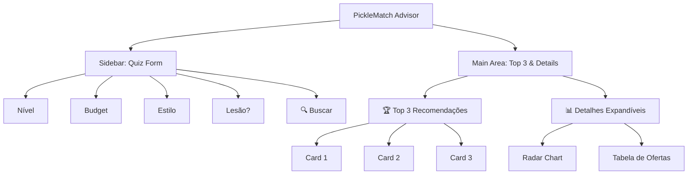
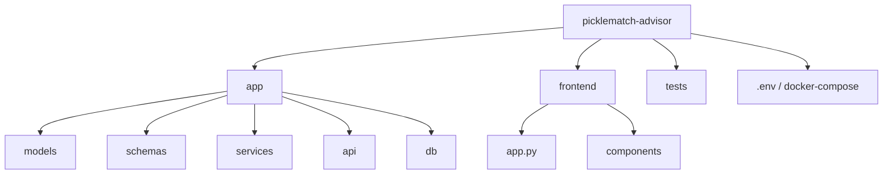

# PRD: PickleMatch Advisor (MVP - Data Engineering First)

## 1. Contexto do Projeto

Uma aplicação web para **recomendação de raquetes de Pickleball** baseada em perfil técnico e físico do jogador.

**Abordagem:** "Hybrid Data Architecture" (Especificações Técnicas Estáticas + Preços de Mercado Dinâmicos).

**Objetivo:** MVP funcional para validar o algoritmo de recomendação.

---

## 2. Tech Stack (Mandatório)

| Componente       | Tecnologia                                      |
| ---------------- | ----------------------------------------------- |
| **Linguagem**    | Python 3.10+                                    |
| **Backend/API**  | FastAPI (integração nativa com Pydantic/Typing) |
| **Database**     | PostgreSQL (via Supabase ou Docker local)       |
| **ORM**          | SQLModel (SQLAlchemy + Pydantic)                |
| **Frontend**     | Next.js 15 + Framer Motion (UX Premium)        |
| **Libs Auxiliares** | `thefuzz`, `pandas`, `plotly`                |

---

## 3. Arquitetura de Dados (Schema)

O sistema deve implementar as seguintes entidades:

### 3.1. Tabela `Brand`

| Campo     | Tipo    | Descrição                            |
| --------- | ------- | ------------------------------------ |
| `id`      | Int     | Primary Key                          |
| `name`    | String  | Ex: "Drop Shot", "Joola", "Selkirk"  |
| `website` | String? | URL do site oficial (opcional)       |

### 3.2. Tabela `PaddleMaster` (Single Source of Truth)

Contém os dados **imutáveis** da raquete.

| Campo                    | Tipo          | Descrição                                        |
| ------------------------ | ------------- | ------------------------------------------------ |
| `id`                     | UUID          | Primary Key                                      |
| `brand_id`               | FK → Brand    | Relacionamento com marca                         |
| `model_name`             | String        | Ex: "Conqueror 13mm"                             |
| `search_keywords`        | Array[String] | Ex: `['conqueror', 'dropshot', '13mm']`          |

**Specs Físicas:**

| Campo              | Tipo   | Descrição           |
| ------------------ | ------ | ------------------- |
| `core_thickness_mm`| Float  | Ex: 13.0, 16.0      |
| `weight_avg_g`     | Int    | Peso médio em gramas|
| `face_material`    | Enum   | `Carbon`, `Fiberglass`, `Hybrid`, `Kevlar` |
| `shape`            | Enum   | `Standard`, `Elongated`, `Widebody` |

**Specs de Performance (0-10):**

| Campo              | Tipo | Descrição         |
| ------------------ | ---- | ----------------- |
| `power_rating`     | Int  | Rating de potência|
| `control_rating`   | Int  | Rating de controle|
| `spin_rating`      | Int  | Rating de spin    |
| `sweet_spot_rating`| Int  | Rating de sweet spot|

**Targeting:**

| Campo                   | Tipo    | Descrição                     |
| ----------------------- | ------- | ----------------------------- |
| `ideal_for_tennis_elbow`| Boolean | Default: False                |
| `skill_level`           | Enum    | `Beginner`, `Intermediate`, `Advanced` |

### 3.3. Tabela `MarketOffer` (Dados Voláteis)

| Campo         | Tipo           | Descrição                    |
| ------------- | -------------- | ---------------------------- |
| `id`          | Int            | Primary Key                  |
| `paddle_id`   | FK → PaddleMaster | Relacionamento com raquete|
| `store_name`  | String         | Ex: "Amazon", "YoSports"     |
| `price_brl`   | Decimal        | Preço em reais               |
| `url`         | String         | Link de afiliado             |
| `last_updated`| Datetime       | Timestamp da última atualização |

---

## 4. Lógica de Negócio (O "Cérebro")

### 4.1. Algoritmo de Recomendação (`RecommendationEngine`)

O sistema deve receber um `UserProfile` e retornar uma lista rankeada de `PaddleMaster`.

#### Input (`UserProfile`):

| Campo            | Tipo    | Opções                              |
| ---------------- | ------- | ----------------------------------- |
| Nível            | Enum    | Iniciante, Intermediário, Avançado  |
| Orçamento        | Decimal | Max Price (BRL)                     |
| Estilo           | Enum    | Power, Control, Balanced            |
| Condição Física  | Boolean | Tem lesão (Tennis Elbow)?           |

#### Lógica de Filtragem:

**Filtro Hard (Eliminatório):**

```python
# Se usuário tem lesão, eliminar raquetes inadequadas
if user.has_tennis_elbow:
    # Raquetes finas e pesadas agravam lesão
    exclude_paddles_where(
        core_thickness_mm < 16 OR weight_avg_g > 240
    )

# Se orçamento definido, eliminar raquetes acima do preço
if user.budget:
    exclude_paddles_where(
        MIN(market_offers.price_brl) > user.budget
    )
```

**Filtro Soft (Ranking):**

```python
if user.style == "Power":
    order_by(power_rating, DESC)
elif user.style == "Control":
    order_by(control_rating, DESC)
elif user.style == "Balanced":
    order_by((power_rating + control_rating) / 2, DESC)
```

### 4.2. Ingestão de Dados (Mock Inicial)

Criar script `seed_data.py` que popula o banco com **5 raquetes reais** para testes imediatos:

1. Drop Shot Conqueror 13mm
2. Joola Perseus
3. Selkirk Vanguard
4. Engage Pursuit Pro
5. Franklin Signature Pro

---

## 5. Frontend Requirements (Next.js 15 + Framer Motion)

Interface **premium, mobile-first e orientada a UX**.

### Layout:



### Componentes:

**Sidebar - Quiz Form:**
- Selectbox: Nível de habilidade
- Slider: Orçamento máximo (R$)
- Radio: Estilo preferido
- Checkbox: Tem Tennis Elbow?
- Button: "🔍 Encontrar Minha Raquete"

**Main Area - Cards de Resultado:**
- Imagem (placeholder ou real)
- Nome do Modelo
- Tags: "Melhor Controle", "Custo-Benefício"
- Preço: "A partir de R$ XXX"
- Botão: "Ver Detalhes"

**Visualização Detalhada (Expandable):**
- **Radar Chart (Plotly):** Gráfico aranha comparando Power vs Control vs Spin vs Sweet Spot
- **Tabela de Ofertas:** Lista de lojas e preços com link externo

---

## 6. Milestones do MVP

| Fase | Entregável                          | Critério de Sucesso                 |
| ---- | ----------------------------------- | ----------------------------------- |
| 1    | Schema implementado + Seed Data     | 5 raquetes cadastradas no DB        |
| 2    | API de Recomendação funcional       | Endpoint retorna lista filtrada     |
| 3    | Interface Streamlit básica          | Usuário completa quiz e vê resultados|
| 4    | Radar Charts + Links de afiliados   | Visualização completa de uma raquete|

---

## 7. Estrutura de Diretórios Proposta



---

## 8. Critérios de Aceitação do MVP

- [ ] Usuário preenche quiz de 4 perguntas
- [ ] Sistema retorna top 3 raquetes recomendadas
- [ ] Raquetes exibidas com preço mínimo disponível
- [ ] Radar chart funcional para cada raquete
- [ ] Links de afiliados clicáveis
- [ ] Filtro de lesão funciona corretamente (exclui raquetes inadequadas)
