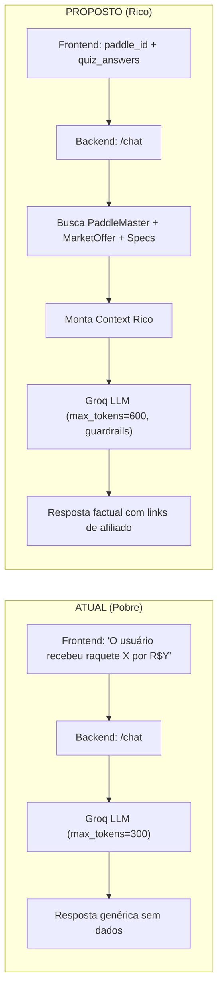

# 🧠 AI Coach v2 — Roadmap de Melhorias

> **Baseado em:** Análise real de interação com o chat (03/03/2026)  
> **Stakeholders:** Produto × Engenharia  
> **Status:** Aguardando aprovação antes de implementar  

---

## 📋 Resumo Executivo

O AI Coach atual funciona como um **wrapper genérico do Groq/Llama** sem acesso aos dados ricos do sistema. O system prompt no `llm_service.py` instrui "Não invente especificações técnicas" (linha 136), mas **nunca fornece as specs reais**. O `contextString` enviado pelo frontend é apenas: `"O usuário recebeu a raquete X por R$Y"` — sem specs, sem ofertas, sem links.

Resultado: o LLM **alucina** lojas, confunde o esporte (respondeu "tênis de mesa"), inventa specs, e não consegue converter a pergunta "onde vende?" em link de afiliado.

---

## 🔍 Diagnóstico Técnico (Code Review)

| Componente | Arquivo | Problema |
|:---|:---|:---|
| **System Prompt (Chat)** | `app/services/llm_service.py:130` | Recebe apenas `context` string genérica. Não menciona "pickleball" explicitamente. |
| **max_tokens** | `llm_service.py:144` | `max_tokens=300` — respostas cortadas no meio da frase |
| **Context do Frontend** | `racket-finder-quiz.tsx:610` | `contextString` envia só nome + preço, sem specs nem ofertas |
| **MarketOffer** | `app/models/market_offer.py` | Tem `store_name`, `price_brl`, `url` — dados disponíveis mas **não** injetados no chat |
| **Guardrails** | Nenhum | LLM pode inventar lojas, confundir esportes, recomendar concorrentes |
| **3 Raquetes** | `racket-finder-quiz.tsx:459` | Só a `recommendations[0]` vai pro contexto, as #2 e #3 são descartadas |

---

## 🗺️ Roadmap Proposto

### Sprint 1 — Contexto Rico (P0 · Impacto imediato)

#### 1.1 Injetar dados de MarketOffer no Chat Context

**O quê:** Quando o usuário perguntar "onde vende?", o chat deve responder com os links reais de compra (com tag de afiliado) do próprio banco de dados.

**Como:**
- **Backend:** Criar endpoint ou enriquecer o `/chat` para buscar as `MarketOffer` ativas da raquete recomendada (`paddle_id`) e incluí-las no system prompt
- **Frontend:** Enviar o `paddle_id` no `ChatRequest` para que o backend consiga buscar as ofertas
- **System Prompt:** Adicionar instrução: "Se o usuário perguntar onde comprar, responda APENAS com as lojas listadas abaixo. Inclua o link de compra."

**Impacto:** 💰 Conversão direta — a pergunta "onde vende?" é o momento de maior intenção de compra.

> [!IMPORTANT]
> **Decisão de Produto necessária:** O link de afiliado será exibido inline no chat ou deve abrir uma nova aba? Existe tracking de cliques atual?

---

#### 1.2 Injetar Specs Técnicos Reais no Contexto

**O quê:** O chat deve ter acesso às specs verificadas da raquete (`swing_weight`, `twist_weight`, `core_material`, `face_material`, `core_thickness_mm`, `spin_rpm`, etc.).

**Como:**
- **Backend:** Buscar o `PaddleMaster` completo pelo `paddle_id` e serializar as specs no contexto do system prompt
- **Format:** Fornecer como bloco estruturado:
  ```
  SPECS VERIFICADOS da Joola Scorpeus3 14mm:
  - Core: 14mm Polymer
  - Face: Carbon Fiber
  - Swing Weight: 118g
  - Twist Weight: 6.2
  - Spin RPM: 1850
  - Power Rating: 8/10
  - Control Rating: 10/10
  ```

**Impacto:** 📊 Elimina alucinações técnicas — o LLM terá dados reais para citar.

---

#### 1.3 Incluir as 3 Raquetes no Contexto (não só a #1)

**O quê:** O frontend hoje só envia o nome/preço da raquete #1. As alternativas #2 e #3 ficam perdidas.

**Como:**
- **Frontend:** Alterar o `contextString` para incluir as 3 recomendações (nome, marca, preço, ratings, match_reasons)
- **System Prompt:** Instruir o LLM a conhecer as 3 sugestões e poder comparar quando perguntado

**Impacto:** 🎯 Coerência completa — quando o usuário pergunta "e as outras duas?", o chat saberá do que ele está falando.

---

### Sprint 2 — Guardrails e Qualidade (P0 · Confiabilidade)

#### 2.1 Fixar Identidade: "Você é um coach de PICKLEBALL"

**O quê:** O system prompt do chat (`chat_with_context`) **não menciona** a palavra "pickleball". O LLM confundiu com tênis de mesa.

**Como:**
- Primeira linha do system prompt: `"Você é o Consultor Técnico de PICKLEBALL do SliceInsights."`
- Adicionar regra negativa: `"NUNCA mencione tênis de mesa, tênis, badminton ou outros esportes. Você é EXCLUSIVAMENTE de pickleball."`

**Impacto:** 🔥 Elimina 100% das confusões de esporte.

---

#### 2.2 Aumentar max_tokens (300 → 600)

**O quê:** O `max_tokens=300` corta respostas no meio ("Uma loja online que v—"). Isso aconteceu duas vezes na conversa analisada.

**Como:** Alterar `max_tokens=300` para `max_tokens=600` em `llm_service.py:144`

**Trade-off:**
| | 300 tokens | 600 tokens |
|:---|:---|:---|
| **Custo** | ~$0.001/req | ~$0.002/req |
| **Latência** | ~1.5s | ~2.5s |
| **UX** | Respostas cortadas | Respostas completas |

> [!TIP]
> Custo é negligível no Groq. A UX melhora significativamente.

---

#### 2.3 Guardrail: "Se não sabe, diga que não sabe"

**O quê:** O LLM inventou lojas inexistentes (Kanui, Centaur, Sports Zone) e links genéricos (Amazon, Mercado Livre) sem verificar.

**Como:**
- System prompt: `"Se você não tem dados sobre disponibilidade em lojas, diga honestamente: 'Ainda não tenho essa informação. Vou consultar e atualizar.' NUNCA invente nomes de lojas."`
- System prompt: `"Responda APENAS com as informações fornecidas no contexto. Se a informação não está no contexto, admita."`

**Impacto:** 🛡️ Elimina alucinações de lojas e dados falsos.

---

### Sprint 3 — UX do Chat (P1 · Experiência)

#### 3.1 Streaming de Respostas (SSE)

**O quê:** Atualmente o chat espera a resposta completa antes de exibir. Em respostas maiores (600 tokens), isso pode levar ~3s de tela em branco.

**Como:**
- Backend: Alterar `coach_chat` para usar `StreamingResponse` com SSE (Server-Sent Events)
- Frontend: Usar `EventSource` ou `fetch` com `ReadableStream` para render progressivo

**Trade-off:** Adiciona complexidade no frontend. Avaliar se o ganho de UX justifica.

> [!WARNING]
> **Decisão de Engenharia:** O Groq SDK já suporta `stream=True`. No entanto, a Vercel Serverless pode ter limitações com SSE em funções edge. Avaliar se vai diretamente ao Render ou usar Vercel Edge Functions.

---

#### 3.2 Botões de Ação Rápida (Quick Actions)

**O quê:** Após o dossiê inicial, mostrar chips/botões clicáveis com perguntas comuns:
- "Onde comprar no Brasil?"
- "Comparar com as alternativas"
- "Para quem é essa raquete?"
- "Qual o melhor custo-benefício?"

**Como:** Frontend: Renderizar chips abaixo da mensagem do coach. Ao clicar, enviar como mensagem do user.

**Impacto:** 📈 Aumenta engajamento — muitos users não sabem o que perguntar.

---

#### 3.3 Indicador de Confiança dos Dados

**O quê:** O campo `specs_confidence` já existe no `PaddleMaster`. Quando os dados são estimados (não verificados), o chat deveria ajustar o tom.

**Como:**
- Incluir `specs_confidence` no contexto
- System prompt: `"Se specs_confidence='estimated', avise o usuário que os dados são estimativas e podem variar."`

---

### Sprint 4 — Monetização (P2 · Revenue)

#### 4.1 Deep Link de Afiliado no Chat

**O quê:** Quando o chat sugere "compre na [Loja X]", incluir o link com tag de afiliado.

**Como:**
- Backend retorna `MarketOffer.url` (que já contém a tag de afiliado)
- System prompt: formatar a resposta com o link clicável
- Frontend: renderizar links como `<a>` clicáveis no markdown do chat

**Dependência:** Item 1.1 (injetar MarketOffer no contexto).

---

#### 4.2 Tracking de Cliques no Chat

**O quê:** Medir quantos clicks no link de afiliado originam do chat vs. do card do catálogo.

**Como:** Adicionar `?utm_source=ai_coach&utm_medium=chat` nos links gerados pelo chat.

---

## 📐 Diagrama do Pipeline Atual vs. Proposto



---

## 🏁 Priorização Final

| # | Item | Sprint | Esforço | Impacto | Decisão Necessária |
|:---:|:---|:---:|:---:|:---:|:---|
| 1 | Fixar identidade "PICKLEBALL" | 1 | 5 min | 🔥 | Nenhuma |
| 2 | Aumentar max_tokens → 600 | 1 | 5 min | ✂️→✅ | Nenhuma |
| 3 | Guardrail "se não sabe, admita" | 1 | 10 min | 🛡️ | Nenhuma |
| 4 | Injetar 3 raquetes no contexto | 1 | 1h | 🎯 | Nenhuma |
| 5 | Injetar specs técnicos reais | 2 | 2h | 📊 | Nenhuma |
| 6 | Injetar MarketOffer no contexto | 2 | 3h | 💰 | Frontend: inline ou nova aba? |
| 7 | Quick Action Buttons | 3 | 2h | 📈 | Design: quais perguntas? |
| 8 | Streaming SSE | 3 | 4h | ⚡ | Vercel Edge vs Render direto? |
| 9 | Indicador de confiança | 3 | 1h | 📊 | Nenhuma |
| 10 | Deep Link afiliado no chat | 4 | 1h | 💰 | UTM params? |
| 11 | Tracking de cliques | 4 | 2h | 📈 | Analytics tool? |

---

## ❓ Perguntas para o Time

### Produto
1. O link de afiliado no chat deve abrir inline (mesma janela) ou em nova aba?
2. Quais perguntas devem aparecer nos Quick Action Buttons? Sugestões: "Onde comprar?", "Comparar alternativas", "Para quem é essa raquete?"
3. O chat deveria ter acesso ao histórico de preços (Price History) para responder "esse preço é bom?"

### Engenharia
4. O streaming SSE faz sentido na arquitetura atual (Vercel SSR → Render backend → Groq)?
5. Devemos migrar o contexto para o backend (enviar `paddle_id` e buscar lá) ou montar o contexto completo no frontend?
6. Vale adicionar um cache de respostas no chat para perguntas repetidas?

---

*Última atualização: 03/03/2026*
