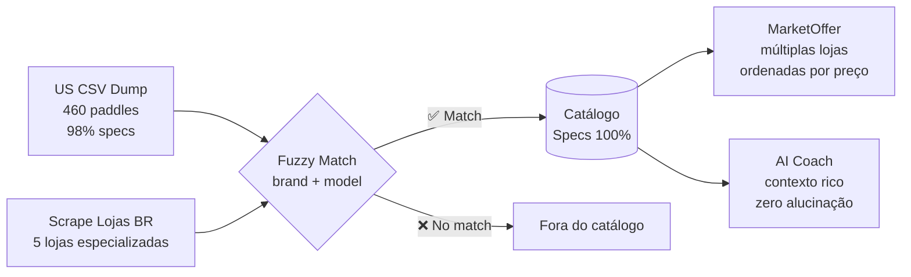

# 📊 Data Quality Roadmap — COMPLETE SPECS ONLY (v3 FINAL)

> **Princípio absoluto:** Se não tem specs completos, NÃO EXISTE no sistema  
> **Público-alvo:** Jogador de pickleball brasileiro (intermediário a elite)  
> **Automação:** 100% agêntica. Zero curadoria manual  
> **Aprovado em:** 04/03/2026  

---

## 🤝 Reunião Produto × Engenharia: Resumo Executivo

### O Problema

O catálogo atual tem 72 raquetes, mas **72% possuem ratings fabricados** (default 5.0). O AI Coach recomenda raquetes sobre as quais ele literalmente não sabe nada — uma experiência desonesta.

### A Descoberta

O US CSV dump (PB Studio, dados de laboratório) contém **460 raquetes com 98% de preenchimento** em TODOS os campos de performance. Quase todas as marcas premium vendidas no Brasil existem nesse dump:

| Marca BR | Qty no US Dump | Vendida em |
|:---|:---:|:---|
| **JOOLA** | 41 | JOOLA Brasil, Decathlon |
| **Engage** | 20 | Brazil Pickleball Store |
| **Selkirk + Labs** | 25 | yoSports, BPS |
| **Diadem** | 12 | Loja Supremo |
| **Paddletek** | 15 | Brazil Pickleball Store |
| **Gearbox** | 27 | BPS |
| **SLK** | 11 | BPS, yoSports |
| **Adidas** | 10 | yoSports, Netshoes |
| **Pro Kennex** | 9 | Pró Spin |
| **ProXR** | 4 | BPS |
| **Head** | 3 | Pró Spin |
| **Babolat** | 3 | Pró Spin |
| **Wilson** | 2 | Pró Spin |
| **Total** | **~182** | |

> [!TIP]
> **Inversão de pipeline:** Em vez de scrape BR → tentar enriquecer, o pipeline deve ser **US dump (specs completos) → filtrar pelo que está disponível em lojas BR**.

### A Decisão: Definição de "Specs Completos"

O time de Produto e Engenharia definiu unanimemente:

> **Uma raquete SÓ entra no catálogo se possuir TODOS os campos obrigatórios preenchidos com dados verificados de fonte confiável.**

---

## 📐 Definição do "Complete Spec Sheet"

### Campos Obrigatórios (TODOS devem estar preenchidos)

| Campo | Tipo | Fonte Primária | Fallback | Criticidade |
|:---|:---:|:---|:---|:---|
| `model_name` | Identidade | Scrape loja BR | — | Nome do produto |
| `brand` | Identidade | Scrape loja BR | — | Marca |
| `image_url` | Visual | Scrape loja BR | Shopify API fabricante | Card no frontend |
| `core_thickness_mm` | Estrutural | US CSV dump | Shopify API fabricante | Filtro tennis elbow, dwell time |
| `face_material` | Estrutural | US CSV dump | Shopify API fabricante | Categorização spin/control |
| `core_material` | Estrutural | US CSV dump | Shopify API fabricante | Educação tecnológica |
| `shape` | Estrutural | US CSV dump | Shopify API fabricante | Ergonomia |
| `swing_weight` | Performance | US CSV dump | ❌ Nenhum | Filtro peso, inércia |
| `spin_rpm` | Performance | US CSV dump | ❌ Nenhum | Rating de spin |
| `power_rating` | Performance | US CSV dump | ❌ Nenhum | Rating de potência |
| `handle_length` | Ergonomia | US CSV dump | Shopify API fabricante | Grip preferência |
| ≥ 1 `MarketOffer` ativa | Mercado | Scrape loja BR | — | Preço + onde comprar |

### Campo REMOVIDO do cálculo

| Campo | Cobertura | Decisão | Motivo |
|:---|:---:|:---|:---|
| `twist_weight` | 31% → apenas via US dump | 🔴 **NÃO usar para ratings** | Cobertura muito baixa mesmo no dump. Rating de Control será derivado de `core_thickness_mm` + `core_material` |

### `specs_confidence` — Fórmula Final

```python
# HONESTIDADE MÁXIMA: binário
# confidence = 1.0 se TODOS os campos obrigatórios estão preenchidos
# confidence = 0.0 caso contrário
# NÃO EXISTE meio-termo. Ou tem tudo, ou não entra.

REQUIRED_FIELDS = [
    'core_thickness_mm', 'face_material', 'core_material', 'shape',
    'swing_weight', 'spin_rpm', 'power_rating', 'handle_length',
]

def calculate_specs_confidence(paddle) -> float:
    for field in REQUIRED_FIELDS:
        if getattr(paddle, field) is None:
            return 0.0
    return 1.0
```

### Rating de Control: Nova Derivação (sem twist_weight)

```python
# ANTES (dependia de twist_weight → 31% cobertura):
# control = (twist_weight - 150) / 450 * 10

# DEPOIS (derivado de core_thickness_mm → 98% cobertura no dump):
# Core mais espesso = mais controle (dwell time maior)
def calculate_control(core_thickness_mm: float) -> int:
    # 13mm = 3/10, 14mm = 5/10, 16mm = 8/10, 19mm = 10/10
    if core_thickness_mm is None:
        return None
    control = (core_thickness_mm - 12) / 7 * 10
    return int(round(min(max(control, 0), 10)))
```

> [!IMPORTANT]
> **Consenso Eng × Produto:** A derivação de Control via `core_thickness_mm` é fisicamente fundamentada (dwell time) e tem cobertura 98% no US dump. Mais honesto e útil que `twist_weight` com 31%.

---

## 🗺️ Pipeline Invertido: "US Dump First"

### Fluxo Antigo (problemático)

```
Scrape loja BR → Criar paddle no DB → Tentar enriquecer com US dump → 72% falha → Default 5.0
```

### Fluxo Novo (honesto)

```
US Dump (specs) ──┐
                  ├── MATCH? ──→ ✅ Criar paddle com specs COMPLETOS
Scrape BR (ofertas)┘                 + MarketOffer(s) ordenadas por preço
                      
                  NÃO MATCH ──→ ❌ NÃO entra no catálogo
```



---

## 🇧🇷 Fontes de Dados Aprovadas

### Lojas BR (Scrape de ofertas — preço, URL, disponibilidade)

| Loja | Marcas | Status | Ação |
|:---|:---|:---:|:---|
| **JOOLA Brasil** | JOOLA | ✅ Existe | Manter |
| **Brazil Pickleball Store** | Engage, Paddletek, Selkirk, ProXR, Gearbox | ✅ Existe | Manter |
| **yoSports** | Selkirk, Zcebra, Adidas | ❌ | 🆕 Criar |
| **Loja Supremo** | Diadem | ❌ | 🆕 Criar |
| **Shark Beach Tennis** | Shark | ❌ | 🆕 Criar |

### Fontes de Specs (Enrichment — dados técnicos)

| Fonte | Dados | Cobertura | Prioridade |
|:---|:---|:---:|:---:|
| **US CSV dump** (PB Studio) | swing_weight, spin_rpm, power, core_mm, face, shape, handle, grip | 98% para 460 paddles | 🔴 P0 — Golden Source |
| **Shopify APIs fabricantes** | core_mm, face_material, shape, image_url | Estrutural apenas | 🟡 P1 — Fallback |

### Ignorados (decisão final)

| Canal | Motivo |
|:---|:---|
| Mercado Livre | Dados inconsistentes, importação direta |
| Shopee | Zero confiabilidade |
| Netshoes / Centauro | Mass-market, kits lazer |
| Decathlon | P3 futuro (apenas Kuikma, fora do target intermediário+) |

---

## 🗺️ Roadmap de Execução

### Fase 1: Pipeline Invertido + Auditoria (🔧 Data Engineer)

**Duração:** 1 dia

#### 1.1 `scripts/audit_data_quality.py`
- Mapear cobertura real por campo no catálogo atual
- Identificar quais paddles BR já têm match no US dump
- Listar paddles BR SEM match (candidatos a remoção)
- Output: relatório de cobertura + lista de ações

#### 1.2 Limpeza Automática
- Remover non-paddles (kits, bolsas, bolas) via keywords
- Remover paddles de lazer (preço < R$ 450)
- Detectar duplicatas cross-loja
- Marcar `specs_confidence = 0.0` em paddles sem specs completos

#### 1.3 Implementar `specs_confidence` Binário
- REQUIRED_FIELDS check: todos ou nada
- Recalcular para todos os paddles existentes
- Filtrar: `WHERE specs_confidence = 1.0`

---

### Fase 2: Expansão de Match US↔BR (🔧 Data + 📊 Analytics)

**Duração:** 2-3 dias

#### 2.1 Fuzzy Match Melhorado
- Threshold: `0.60 → 0.55` para marcas confirmadas
- Novos alias: `"3Rdshot" → "3rdshot"`, `"Pro Kennex" → "pro kennex"`
- Log de near misses (0.50-0.55) para pipeline futuro
- **Meta:** Maximizar matches BR↔US

#### 2.2 Novos Scrapers BR (3 lojas)

| Script | Domínio | Dados Coletados |
|:---|:---|:---|
| `scrape_yosports.py` | yosports.com.br | Ofertas: nome, preço, URL, imagem |
| `scrape_supremo.py` | lojasupremo.com.br | Ofertas: nome, preço, URL, imagem |
| `scrape_shark.py` | sharkbeachtennis.com.br | Ofertas: nome, preço, URL, imagem |

> Scrapers BR coletam **apenas ofertas** (preço + URL). Specs vêm do US dump. Se a raquete não existe no US dump → não entra.

#### 2.3 Multi-Oferta: Consolidar por Paddle
- Mesma raquete em múltiplas lojas → múltiplos `MarketOffer`
- Ordenar por `price_brl ASC`
- Deduplicar: match por `brand_name` + `model_name` normalizado

#### 2.4 Ampliar Shopify API de Fabricantes
- Completar campos estruturais faltantes (image_url, shape) de 7 novos fabricantes
- Apenas para paddles que JÁ passaram no match US dump

---

### Fase 3: Backend 100% Honesto (⚙️ Backend Specialist)

**Duração:** 1 dia

#### 3.1 Quality Gate Absoluto
```python
# recommendation_engine.py
query = query.where(PaddleMaster.specs_confidence == 1.0)
```

#### 3.2 Novo Rating de Control (sem twist_weight)
- Derivar de `core_thickness_mm` (fundamentação física: dwell time)
- `twist_weight` permanece como campo informativo, mas NÃO calcula rating

#### 3.3 Context Builder para Chat
- Incluir ALL specs verificados no context do LLM
- Incluir TODAS as ofertas (multi-loja, ordenadas por preço)
- Incluir `specs_confidence = 1.0` para o LLM ter confiança total

#### 3.4 API Filtrada
- `/paddles` → somente `specs_confidence = 1.0`
- `/recommendations` → somente `specs_confidence = 1.0`
- Catálogo frontend → somente specs completos

---

### Fase 4: Validação (📊 Analytics + 🧪 QA)

**Duração:** 1 dia

#### 4.1 Smoke Test: `scripts/test_data_quality.py`
- ❌ Falha se QUALQUER paddle ativo tem `specs_confidence < 1.0`
- ❌ Falha se QUALQUER rating é calculado com default 5.0
- ❌ Falha se paddle ativo não tem `MarketOffer`
- ✅ Passa se todos os paddles ativos têm ALL required fields

#### 4.2 Métricas de Qualidade

| Métrica | Meta |
|:---|:---:|
| Paddles com specs 100% completos | **100%** do catálogo ativo |
| Ratings com defaults fabricados | **0%** |
| Campos obrigatórios NULL no catálogo | **0** |
| Coach cita specs reais | **100%** |
| Lojas BR com scraper | ≥ 5 |

---

## 📐 Projeção de Impacto

| Métrica | Antes | Após Roadmap |
|:---|:---:|:---:|
| Paddles no catálogo | 72 (muitos vazios) | **35-55** (100% completos) |
| Specs completos | 20 (28%) | **35-55 (100%)** |
| Ratings com defaults | 72% | **0%** |
| Multi-oferta (média) | 1.0 | 1.5-2.0 |
| Lojas BR com scraper | 2 | 5 |
| Marcas com specs completos | ~6 | 10-12 |
| Coach confiança | 28% dos casos | **100%** |

> [!WARNING]
> **Trade-off aceito:** O catálogo pode diminuir de 72 para 35-55 raquetes. Mas CADA uma terá dados 100% verificados. O AI Coach nunca mais vai inventar, chutar ou alucinar specs.

---

## 🏗️ Plano de Execução

| Sprint | Duração | Agentes | Entregáveis |
|:---:|:---:|:---|:---|
| **1** | 1 dia | 🔧 Data Engineer | Auditoria, limpeza, `specs_confidence` binário |
| **2** | 2-3 dias | 🔧 Data + 📊 Analytics | 3 scrapers BR, fuzzy match melhorado, multi-oferta |
| **3** | 1 dia | ⚙️ Backend | Quality gate, novo Control rating, context builder |
| **4** | 1 dia | 📊 Analytics + 🧪 QA | Smoke tests, validação 100% |

**Total: 5-6 dias**

---

## ✅ Consenso do Time

| Participante | Posição |
|:---|:---|
| 🎯 **Produto** | Catálogo menor, mas 100% confiável. Zero risco de alucinação. |
| 🔧 **Data Engineer** | Pipeline invertido (US dump → BR match) é viável. US dump cobre 182 paddles de marcas BR. |
| 📊 **Analytics** | Control via core_thickness_mm é fisicamente defensável. twist_weight descartado por cobertura insuficiente. |
| ⚙️ **Backend** | Quality gate `specs_confidence == 1.0` é simples e absolutamente seguro. |
| 🧪 **QA** | Smoke test binário: 100% ou falha. Sem zona cinza. |

---

*Aprovado unanimemente. Pronto para implementação.*
