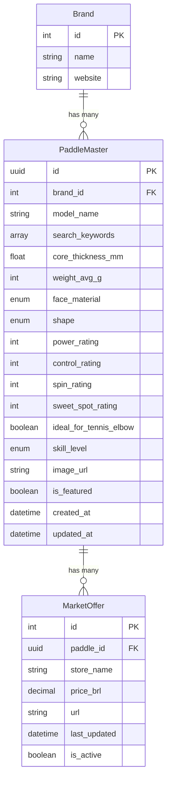

# Database Schema - PickleMatch Advisor

## Overview

Arquitetura híbrida com dados estáticos (specs técnicas) e dados voláteis (preços de mercado).

---

## Entity Relationship Diagram



---

## Enums

### FaceMaterial
```python
class FaceMaterial(str, Enum):
    CARBON = "carbon"
    FIBERGLASS = "fiberglass"
    HYBRID = "hybrid"
    KEVLAR = "kevlar"
```

### PaddleShape
```python
class PaddleShape(str, Enum):
    STANDARD = "standard"
    ELONGATED = "elongated"
    WIDEBODY = "widebody"
```

### SkillLevel
```python
class SkillLevel(str, Enum):
    BEGINNER = "beginner"
    INTERMEDIATE = "intermediate"
    ADVANCED = "advanced"
```

### PlayStyle (UserProfile)
```python
class PlayStyle(str, Enum):
    POWER = "power"
    CONTROL = "control"
    BALANCED = "balanced"
```

---

## SQLModel Definitions

### Brand Model

```python
from sqlmodel import SQLModel, Field
from typing import Optional

class Brand(SQLModel, table=True):
    id: Optional[int] = Field(default=None, primary_key=True)
    name: str = Field(index=True, unique=True)
    website: Optional[str] = None
```

### PaddleMaster Model

```python
from sqlmodel import SQLModel, Field, Relationship
from typing import Optional, List
from uuid import UUID, uuid4
from datetime import datetime

class PaddleMaster(PaddleMasterBase, table=True):
    """PaddleMaster database model - Single Source of Truth for paddle specs."""
    __tablename__ = "paddle_master"
    
    id: UUID = Field(default_factory=uuid4, primary_key=True)
    brand_id: int = Field(foreign_key="brands.id")
    search_keywords: List[str] = Field(
        default=[],
        sa_column=Column(ARRAY(String), nullable=False, server_default="{}")
    )
    
    # Metadata
    available_in_brazil: bool = Field(default=True)
    specs_source: Optional[str] = None
    specs_confidence: float = Field(default=1.0)
    is_featured: bool = False
    image_url: Optional[str] = None
    
    # Timestamps
    created_at: datetime = Field(default_factory=datetime.utcnow)
    updated_at: datetime = Field(default_factory=datetime.utcnow)
    
    # Relationships
    brand: Optional["Brand"] = Relationship(back_populates="paddles")
    market_offers: List["MarketOffer"] = Relationship(back_populates="paddle")
```

### MarketOffer Model

```python
from sqlmodel import SQLModel, Field, Relationship
from typing import Optional
from uuid import UUID
from datetime import datetime
from decimal import Decimal

class MarketOffer(SQLModel, table=True):
    id: Optional[int] = Field(default=None, primary_key=True)
    paddle_id: UUID = Field(foreign_key="paddlemaster.id")
    store_name: str
    price_brl: Decimal = Field(decimal_places=2)
    url: str
    affiliate_url: Optional[str] = None
    last_updated: datetime = Field(default_factory=datetime.utcnow)
    is_active: bool = True
    
    # Relationships
    paddle: Optional[PaddleMaster] = Relationship(back_populates="market_offers")
```

---

## Indexes

```sql
-- Para buscas por marca
CREATE INDEX idx_paddle_brand ON paddlemaster(brand_id);

-- Para filtros de lesão
CREATE INDEX idx_paddle_tennis_elbow ON paddlemaster(ideal_for_tennis_elbow);

-- Para ordenação por ratings
CREATE INDEX idx_paddle_power ON paddlemaster(power_rating DESC);
CREATE INDEX idx_paddle_control ON paddlemaster(control_rating DESC);

-- Para busca de ofertas ativas
CREATE INDEX idx_offer_active ON marketoffer(paddle_id, is_active) WHERE is_active = true;

-- Para busca de menor preço
CREATE INDEX idx_offer_price ON marketoffer(paddle_id, price_brl) WHERE is_active = true;
```

---

## Migrations Strategy

Usar **Alembic** para versionamento de schema:

```bash
# Inicializar alembic
alembic init migrations

# Criar migration
alembic revision --autogenerate -m "initial_schema"

# Aplicar migrations
alembic upgrade head
```

---

## Seed Data Example

```python
# seed_data.py
brands = [
    Brand(name="Drop Shot", website="https://dropshot.es"),
    Brand(name="Joola", website="https://joola.com"),
    Brand(name="Selkirk", website="https://selkirk.com"),
    Brand(name="Engage", website="https://engagepickleball.com"),
    Brand(name="Franklin", website="https://franklinsports.com"),
]

paddles = [
    PaddleMaster(
        brand_id=1,  # Drop Shot
        model_name="Conqueror 13mm",
        search_keywords=["conqueror", "dropshot", "13mm", "power"],
        core_thickness_mm=13.0,
        weight_avg_g=230,
        face_material=FaceMaterial.CARBON,
        shape=PaddleShape.ELONGATED,
        power_rating=9,
        control_rating=6,
        spin_rating=8,
        sweet_spot_rating=7,
        ideal_for_tennis_elbow=False,
        skill_level=SkillLevel.ADVANCED,
    ),
    # ... mais raquetes
]
```
