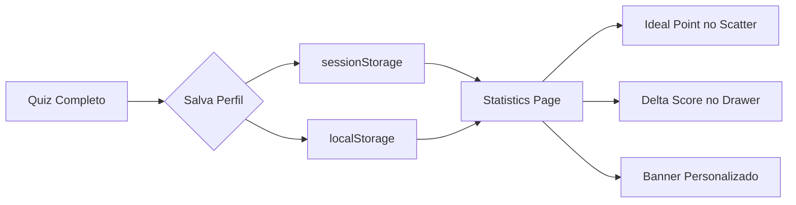

# Hyper-Personalization Engine

**Versão:** 1.6  
**Componentes:** `RacketFinderQuiz`, `StatisticsClient`

---

## Visão Geral

O sistema de Hyper-Personalização conecta as respostas do usuário no Quiz de 10 perguntas com a visualização de dados na página de Estatísticas, criando uma experiência única e personalizada.



---

## 1. Persistência do Perfil

Após completar o Quiz, os dados são salvos em dois locais para redundância:

### Storage Keys
| Key | Location | Conteúdo |
|-----|----------|----------|
| `slice_quiz_results` | `sessionStorage` | Perfil completo (respostas + request + timestamp) |
| `user_profile` | `localStorage` | Cópia para persistência entre sessões |

### Estrutura do Payload
```json
{
  "answers": {
    "skill_level": "intermediate",
    "help_with": "soft_game",
    "play_style_mix": "40",
    ...
  },
  "request": {
    "skill_level": "intermediate",
    "play_style": "control",
    "power_preference_percent": 40,
    ...
  },
  "timestamp": "2026-01-24T22:00:00.000Z"
}
```

---

## 2. Ideal Point (Ponto Ideal)

O "Ideal Point" é a representação visual das preferências do usuário nos gráficos de dispersão (Scatter Charts) da página de Estatísticas.

### Cálculo do Ideal Point

```typescript
// frontend/components/statistics-client.tsx

const idealPoint = useMemo<IdealPoint | null>(() => {
    if (!userProfile) return null;
    const req = userProfile.request;

    // Inferir valores de 0-10 baseado nas preferências
    let power = 5, control = 5, spin = 5, sweetSpot = 5;

    // Play Style
    if (req.play_style === 'power') { power = 8; control = 4; }
    else if (req.play_style === 'control') { power = 4; control = 8; }

    // Slider
    if (req.power_preference_percent !== undefined) {
        power = req.power_preference_percent / 10;
        control = (100 - req.power_preference_percent) / 10;
    }

    // Spin Preference
    if (req.spin_preference === 'high') spin = 9;
    else if (req.spin_preference === 'medium') spin = 6;

    return { power, control, spin, sweetSpot };
}, [userProfile]);
```

### Renderização no Scatter Chart

O Ideal Point é exibido como um ponto destacado (laranja, maior) nos gráficos:

```tsx
{idealPoint && (
    <ReferenceDot
        x={idealPoint.power}
        y={idealPoint.control}
        r={8}
        fill="#FF9800"
        stroke="#FFF"
        strokeWidth={2}
        label={{ value: "Seu Ideal", position: "top" }}
    />
)}
```

---

## 3. Delta Score (Distância ao Ideal)

O Delta Score indica o quão próxima uma raquete está do Ideal Point do usuário. É exibido no `PaddleDetailDrawer`.

### Fórmula

```
Delta = √((Power_paddle - Power_ideal)² + (Control_paddle - Control_ideal)²)

Match Score (%) = max(0, 100 - (Delta * 10))
```

**Exemplo:** Se a raquete tem Power=7 e Control=6, e o Ideal é Power=6 e Control=8:
- Delta = √((7-6)² + (6-8)²) = √(1 + 4) = √5 ≈ 2.24
- Match Score = 100 - (2.24 * 10) = 77.6%

### Implementação

```typescript
// frontend/components/paddle/paddle-detail-drawer.tsx

const delta = idealPoint
    ? Math.sqrt(
        Math.pow(paddle.power - idealPoint.power, 2) +
        Math.pow(paddle.control - idealPoint.control, 2)
      )
    : null;

const matchScore = delta !== null ? Math.max(0, 100 - delta * 10) : null;
```

---

## 4. Banner "Modo Personalizado Ativo"

Quando o usuário possui um perfil salvo, a página de Estatísticas exibe um banner informando que a experiência está personalizada.

### Comportamento

| Condição | Resultado |
|----------|-----------|
| `userProfile !== null` | Exibe banner |
| Clique em "Resetar" | Remove `slice_quiz_results` e recarrega página |

### Código

```tsx
{userProfile && (
    <div className="bg-primary/10 border border-primary/30 p-4 rounded-2xl ...">
        <Star className="w-5 h-5 text-primary" />
        <p>Modo Personalizado Ativo</p>
        <Button onClick={() => {
            sessionStorage.removeItem('slice_quiz_results');
            window.location.reload();
        }}>
            Resetar
        </Button>
    </div>
)}
```

---

## Referências

- [Quiz Documentation](quiz.md)
- [Recommendation System](recommendation_system.md)
- [Statistics Page (Component)](../frontend/components/statistics-client.tsx)
